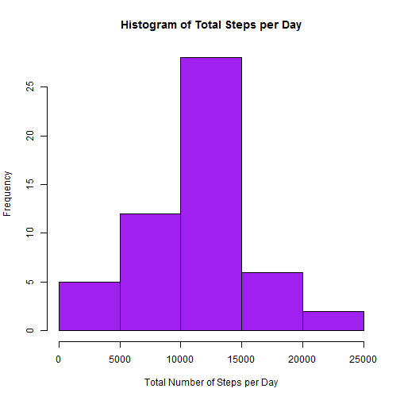
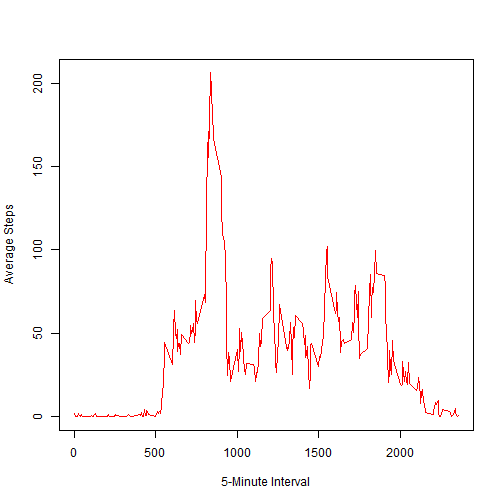
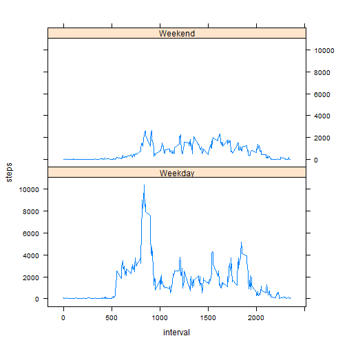

  ----

### Load Required Libraries  

```r
    library(lattice)
    library(plyr)
```
  
  ----
  
### Loading and preprocessing the data  

* Read data into data frame  
  

```r
    data <- read.csv(paste(c(getwd(),"/activity.csv"),collapse=""))
```


  * Convert date variable to date format  
  

```r
    data$date <- as.Date(data$date)
```


* Create subset with observations containing NA values removed  
  

```r
    amdata <- data[complete.cases(data),]
```

  ----

### Mean total number of steps taken per day  


  * Make a histogram of the total number of steps taken each day     
  

```r
    stepsbyday<- ddply(amdata, c("date"), function (x) apply(x[1], 2, sum))
    hist(stepsbyday$steps,main="Histogram of Total Steps per Day",xlab=
           "Total Number of Steps per Day",ylab="Frequency",col='purple')    
```

 


  * Report the mean total number of steps taken each day  
  

```r
    origmean <- as.integer(mean(stepsbyday$steps))
```
    The mean of the dataset is 10766


  * Report the median total number of steps taken each day  
  

```r
    origmed <- median(stepsbyday$steps)
```
    The median of the dataset is 10765  

  ----

### Average daily activity pattern  


  * Time series plot of the 5-minute interval and average number of steps taken   
    averaged across all days  


```r
    stepsbyinterval <- aggregate(steps ~ interval, data=amdata, FUN=mean)
    plot(stepsbyinterval, type="l",xlab="5-Minute Interval", ylab=
           "Average Steps",col="red")
```

 


  * Which 5-minute interval, on average across all the days in the dataset, 
    contains the maximum number of steps?   
    

```r
      intwithmax <- stepsbyinterval$interval[which.max(stepsbyinterval$steps)]
```
    The interval 835 contains the maximum number of steps  

  ----

### Imputing Missing Values   


  * Calculate and report the total number of missing values in the dataset 
    (ie, the total number of rows with NAs)  
    

```r
      numNAs <- sum(is.na(data))
```
    The total number of observations with NA values is: 2304  
    
    
  * Devise a strategy for fill in all of the missing values in the dataset
     - Strategy is to replace NAs with average for the corresponding interval    
      
     --- 
  * Create a new dataset that is equal to the original dataset but with the 
    missing data filled in    
      
      

```r
    ##Get averages for full dataset (with NA observations)
    fullstepsbyinterval <- aggregate(steps ~ interval, data=amdata, FUN=mean)
    
    ##Merge the orginal dataset with the average interval values 
    newdataset <- merge(data, fullstepsbyinterval, by="interval")

    ##Update NA steps.x to steps.y 
    for (i in 1:nrow(newdataset))
      {
      if (is.na(newdataset[i,]$steps.x))
        {
          newdataset[i,]$steps.x <- round(newdataset[i,]$steps.y,digits=0)
        }
      }
  
    ##Remove columns not required
    newdataset <- newdataset[,1:3]

    ##Reset columns names to original 
    colnames(newdataset) <- c("interval","steps","date")

    ##Change column types to original 
     newdataset$steps <- as.integer(newdataset$steps)
```

The new dateset contains 17568 rows:  
    - 0 observations contain NA values 


* Make a histogram of the total number of steps each day with the imputed data  
  

```r
    stepsbyday2<- ddply(newdataset, c("date"), function (x) apply(x[2], 2, sum))
    hist(stepsbyday2$steps,main="Histogram of Total Steps per Day (new data)",
         xlab="Total Number of Steps per Day",ylab="Frequency",col='purple')    
```

.png) 


  * Report the mean total number of steps taken each day with the imputed data  
  

```r
    newmean <- as.integer(mean(stepsbyday2$steps))
```
  The mean of the imputed dataset is 10765  
  
  * Report the median total number of steps taken each day with the imputed data    
    

```r
     newmed <- median(stepsbyday2$steps)
```
  The median of the imputed dataset is 10762  
  
  
  * Do these values differ from the original estimates? What is the impact of 
    imputing missing data on the estimate of the total daily number of steps?   
    
    - The mean of the two datasets is the same 
    - The median is slightly lower than the original 
    - The histograms have a relatively consistent shape, however, the frequency 
      is higher in the imputed data.    

  ----

### Activity patterns on weekdays and weekends


  * Create a new factor variable in the dateset with two levels - "weekday" and 
    "weekend"  
    

```r
    ##Add empty variable for type of day
    newdataset$typeday <- ""
    
    ##Add type of day   
    for (i in 1:nrow(newdataset))
    {
      if(weekdays(newdataset[i,]$date) %in% c("Saturday", "Sunday"))
      {
        newdataset[i,]$typeday <- "Weekend"
      }
        
      else newdataset[i,]$typeday <- "Weekday"
    
    }
    
    ##Convert to factor
    newdataset$typeday <- as.factor(newdataset$typeday)
```


  * Make a panel plot containing a time series plot (ie, type = "l") of the 
    5-minute interval and the average number of steps taken, averaged across all
    weekdays/weekend days  
    

```r
  ##Create dataset with average by typeday and interval
  stepsbydaytype<- ddply(newdataset, c("interval","typeday"), 
                         function (x) apply(x[2], 2, sum))
  ##Plot in 2 panels 
  xyplot(steps~interval|factor(typeday),data=stepsbydaytype,aspect=1/2,type="l")
```

 

  ----
  
